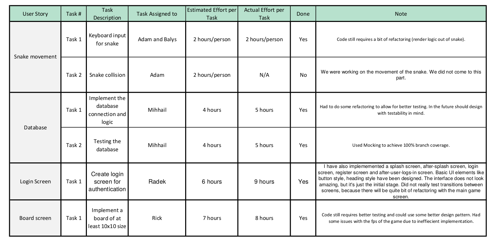

#### 

#### Main problems encountered:

**Problem #1**:

As this was the first sprint it was hard to set everything up and follow on what we needed to do. We ware a bit lost on what we have done already and what still needs to be done. Also some confusion arose on what and where to submit our work. Now it will be easier as we already are much more familiar with the system and what to do. We shall discuss more about about each other work to make sure that everyone is on the same page in the future.

**Problem #2**:

There was coding conflicts where accidentally same feature was almost implemented twice. Obvious decision was made to check branches, issues in GitLab and Whats app group chat to make sure that a member does not start implementing something that is already there. 

**Problem #3**:

While implementing the database we started without first writing tests and the code became very untestable. After the implementation the code had to be refactored to enable better tests usage. From now on we always try to focus on writing code that is testable immediately or write a bit of code and then test, then write some more code and test again, etc., do it incrementally, not in two different batches.

**Problem #4**:

We should have merged earlier. We encountered this problem in the end of the sprint, where we wanted to merge everything into one branch, but since there was a few big branches with a lot of work on them it was hard to connect everything up together correctly. We discussed that we will merge more often and not have these big dominating branches, but small (only for a feature, or even smaller) for easier management.

**Overview**

Overall our main problem was lack of communication and focusing on individual work. We aim to fix this by talking to each other more and following the plan that was made in GitLab. It should be easier from now on, because this was only the beginning of the project and now that everything has a more solid base and our vision is more on par with each other we can work more efficiently and without any collisions. We do also aim to improve individually also by writing code that is more clean and understandable for all members in the group.