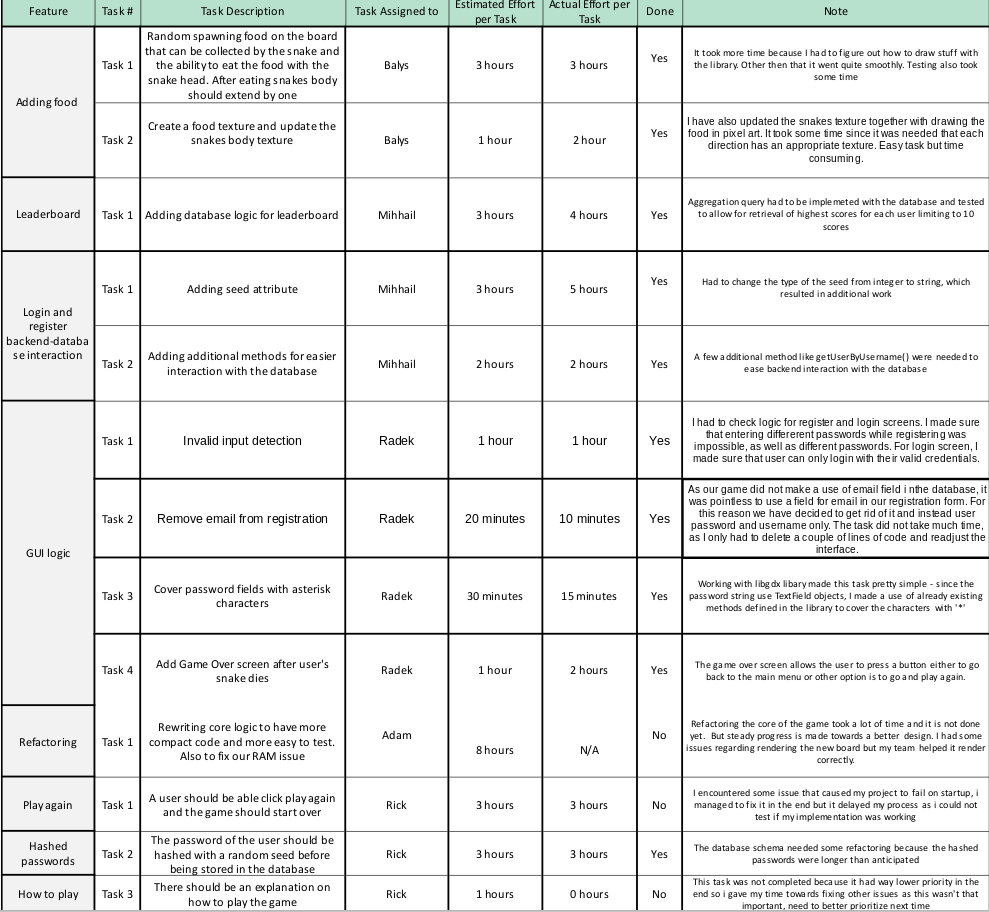

2019/12/19

# Retrospective 2

### Table:

### Problems encountered:

1. We still encounter problems where we need to re-factor our code because it is either not testable or hardly working. After starting doing so of course more problems appeared, but some that we had before have been fixed like the game generating a lot of assets and occupying too much RAM space. Now it uses a stable amount of RAM and does not crash the game after a significant period of time. Also some refactoring on the database was required, but it was quite an easy fix it just took some extra time. Overall it is getting better because we are communicating more clearly on what needs to be done.

2. One of our teammates encountered an Intellij problem where for some reason it could not locate some required library texture files and he was unable to run our system for some time, which lead to some work being delayed. The issue was resolved after an update of Intellij.  

   

### Overview and adjustments:

We believe that we have improved significantly with the process and how we manage our work from last week. We started doing more in-depth code reviews and checking each other work much more serious. We also communicate in group chat more and overall are able to depict what needs to be done better. It is also no problem when assigning tasks because each member is willing to work. We also now merge smaller features then before thus encountering less merge requests and it is much easier to follow what each person has done and how the implemented functionality works. For next week we will try to focus more on writing clean and structured code and refactoring to implement a design pattern, also making sure that everyone understands the logic better while doing so.
