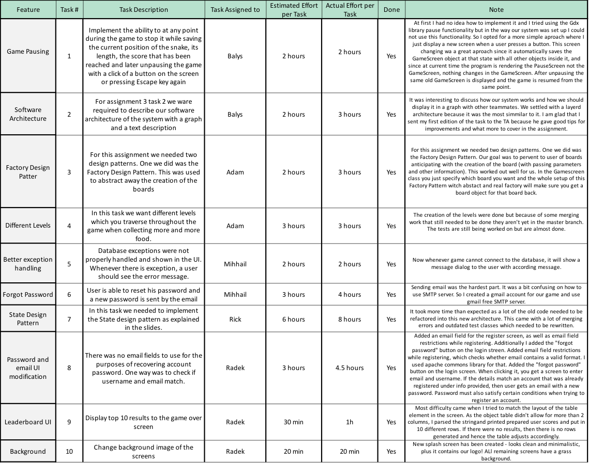

2019/12/19

# Retrospective 2

### Table:

### Problems encountered:

1. The refactoring of our code base was a bit of a hassle. So in order to implement the design patterns necessary for this assignment we had to change a lot of our code, meaning it took a while and required a lot of bug fixing and reasoning on what decision is best to be made. There was no particular way we solved this, we just did the work and it turned out well in the end.
2. The database we are using is the one from the TU Delft servers. Which sometimes is great, but sometimes it just stop letting you send requests and blocks everything you do, so in order to log in or continue working and testing your code you need to switch to a local database which can be a hassle. 
3. Problems with GUI from the Gdx library. One of our teammates encountered difficulties when trying to create nice GUI for our game screens, the code just kept breaking and we could not complete the ideal design so we just opted for a simpler look for now.

### Overview and adjustments:

Overall, we really improved as a team during this process, we all had some significant and diverse roles which helped to   be on time with the assignments and in general I think people ware more focused on their work because they had the ability to choose what they liked more. 